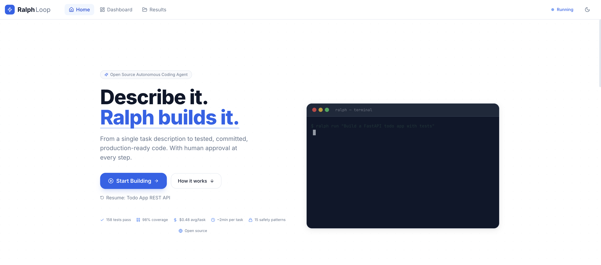

<div align="center">

# Ralph Loop

### Autonomous Coding Agent

**Describe it. Ralph builds it.**

From a single task description to tested, committed, production-ready code<br/>with human approval at every step.

[]()
[]()
[]()
[]()
[]()

<br/>



</div>

<br/>

---

## Overview

Ralph Loop takes a plain-English task description and autonomously builds the entire project — specification, task breakdown, code, tests, QA review, and git commits. You approve the spec and task list before any coding begins. Every change is reviewed by a separate QA agent. If something fails, a healer agent fixes it automatically.

The result: tested, committed code with clean git history, delivered in minutes.

---

## At a Glance

<table>
<tr>
<td width="50%">

**What you provide**
- A task description in plain English
- Your API key
- Budget limit (optional)

</td>
<td width="50%">

**What Ralph delivers**
- Application specification (`spec.md`)
- Atomic task breakdown (`prd.json`)
- Working code with tests
- Clean git history (1 commit per task)
- Cost and analytics dashboard

</td>
</tr>
</table>

---

## Proven Results

These are actual runs with real API calls — not benchmarks, not mocks.

<table>
<thead>
<tr>
<th>Project</th>
<th>Tasks</th>
<th>Tests Generated</th>
<th>Coverage</th>
<th>Cost</th>
<th>Time</th>
</tr>
</thead>
<tbody>
<tr>
<td><strong>Todo API</strong><br/><sub>FastAPI + SQLite + CRUD + validation</sub></td>
<td>10/10</td>
<td>47 pass</td>
<td>—</td>
<td>$2.48</td>
<td>20 min</td>
</tr>
<tr>
<td><strong>URL Shortener</strong><br/><sub>Cache + rate limiting + click tracking</sub></td>
<td>6/6</td>
<td>35 pass</td>
<td>—</td>
<td>$2.81</td>
<td>20 min</td>
</tr>
<tr>
<td><strong>Unit Converter</strong><br/><sub>CLI + 3 unit types + registry pattern</sub></td>
<td>12/12</td>
<td>66 pass</td>
<td>98%</td>
<td>$5.73</td>
<td>30 min</td>
</tr>
<tr>
<td><strong>Existing Codebase</strong><br/><sub>Add search to Todo API (zero regressions)</sub></td>
<td>2/2</td>
<td>58 pass</td>
<td>—</td>
<td>$0.89</td>
<td>9 min</td>
</tr>
</tbody>
</table>

> **35 out of 35 real API tasks completed. 158 framework tests passing.**

---

## How It Works

```
┌─────────────────────────────────────────────────────────────────┐
│                                                                   │
│   You: "Build a REST API with FastAPI for managing todo items"    │
│                                                                   │
│         │                                                         │
│         ▼                                                         │
│   ┌─────────────┐                                                │
│   │ SPEC GEN    │  LLM writes spec.md                            │
│   └──────┬──────┘  (architecture, models, API, tests)            │
│          │                                                        │
│          ▼                                                        │
│   ┌─────────────┐                                                │
│   │ YOU REVIEW  │  Full-screen markdown viewer                   │
│   │ & APPROVE   │  Edit, download, or reject                     │
│   └──────┬──────┘                                                │
│          │                                                        │
│          ▼                                                        │
│   ┌─────────────┐                                                │
│   │ TASK SPLIT  │  spec.md → atomic tasks (prd.json)             │
│   └──────┬──────┘  Each with acceptance criteria                 │
│          │                                                        │
│          ▼                                                        │
│   ┌─────────────┐  For each task:                                │
│   │ CODE LOOP   │  Code → Test → QA Review → Heal → Commit      │
│   │             │  Fresh context per iteration                    │
│   └──────┬──────┘  Separate QA sentinel per task                 │
│          │                                                        │
│          ▼                                                        │
│   ┌─────────────┐                                                │
│   │ DELIVERED   │  All tests pass. Clean git. Analytics.         │
│   └─────────────┘                                                │
│                                                                   │
└─────────────────────────────────────────────────────────────────┘
```

---

## Setup

### Prerequisites

| Requirement | Why |
|-------------|-----|
| Python 3.12+ | Runtime |
| Claude Code CLI | `npm install -g @anthropic-ai/claude-code` |
| Anthropic API key | Or Azure Foundry endpoint, or OpenAI key |
| Node.js 18+ | Only if modifying the web dashboard |

### Install

```bash
git clone https://github.com/fnusatvik07/autonomous-coding-ralph-loop.git
cd autonomous-coding-ralph-loop

# With uv (recommended)
uv pip install -e ".[web]"

# Or with pip
pip install -e ".[web]"
```

> Drop `[web]` if you only want the CLI without the dashboard.

### Configure

```bash
cp .env.example .env
```

Then set your API key in `.env`:

<details>
<summary><strong>Option A — Anthropic API (simplest)</strong></summary>

```env
ANTHROPIC_API_KEY=sk-ant-your-key-here
```
</details>

<details>
<summary><strong>Option B — Azure Foundry</strong></summary>

```env
CLAUDE_CODE_USE_FOUNDRY=1
ANTHROPIC_FOUNDRY_API_KEY=your-foundry-key
ANTHROPIC_FOUNDRY_BASE_URL=https://your-endpoint.azure.com/anthropic/
ANTHROPIC_DEFAULT_SONNET_MODEL=claude-opus-4-6
```
</details>

<details>
<summary><strong>Option C — OpenAI (via Deep Agents)</strong></summary>

```env
OPENAI_API_KEY=sk-proj-your-key-here
RALPH_PROVIDER=deep-agents
RALPH_MODEL=openai:gpt-4o
```
</details>

### Verify

```bash
ralph --version
ralph --help
```

---

## Usage

### CLI

```bash
ralph run "Build a REST API with FastAPI for a todo app"

ralph run "Build a CLI tool" -m claude-opus-4-20250514     # specific model
ralph run "Build something" --budget 10.00                  # budget cap
ralph run "Add auth" -w ./my-project                        # existing project

ralph resume -w ./my-project                                # continue previous run
ralph status -w ./my-project                                # check progress
ralph analytics -w ./my-project                             # cost breakdown
```

### Web Dashboard

```bash
ralph web                    # opens http://localhost:8420
ralph web -w ./my-project    # point at specific workspace
ralph web -p 9000            # custom port
```

The dashboard walks you through: **task input** → **spec review** → **task approval** → **live coding terminal** → **results browser**

---

## Key Features

<table>
<tr>
<td width="33%">

**2-Step Spec Flow**<br/>
<sub>Task → spec.md → human review → prd.json → human review → code. Nothing runs without approval.</sub>

</td>
<td width="33%">

**QA Sentinel**<br/>
<sub>A separate LLM session reviews every code change. Blocks on failing tests, security issues, or missing coverage.</sub>

</td>
<td width="33%">

**Healer Loop**<br/>
<sub>When QA fails, a debugging specialist iterates up to 5 times. Auto-rollback on final failure.</sub>

</td>
</tr>
<tr>
<td>

**Multi-Model Routing**<br/>
<sub>Haiku for scaffolding. Sonnet for features. Opus for architecture. 60% cost reduction.</sub>

</td>
<td>

**Reflexion**<br/>
<sub>LLM analyzes why it failed and stores the lesson. Future iterations read these before starting.</sub>

</td>
<td>

**Git Checkpoints**<br/>
<sub>Tags before each task. Rollback to last known-good state on failure. Clean squash on success.</sub>

</td>
</tr>
<tr>
<td>

**Budget Control**<br/>
<sub>Set a max spend with `--budget`. Warning at 80%. Hard stop when exceeded.</sub>

</td>
<td>

**Full Observability**<br/>
<sub>sessions.jsonl with cost/duration per session. Structured logging. Web analytics dashboard.</sub>

</td>
<td>

**Safety**<br/>
<sub>15 regex patterns blocking dangerous shell commands. acceptEdits permission model. Env filtering.</sub>

</td>
</tr>
</table>

---

## Project Structure

```
ralph/
├── cli.py                # CLI commands
├── config.py             # Configuration
├── loop.py               # Main orchestrator
├── models.py             # Data models
├── providers/
│   ├── claude_sdk.py     # Claude Agent SDK
│   └── deep_agents.py    # Deep Agents SDK (any LLM)
├── prompts/
│   └── templates.py      # All prompt templates
├── spec/
│   └── generator.py      # spec.md → prd.json
├── qa/
│   ├── sentinel.py       # Quality gate
│   └── healer.py         # Fix loop
├── routing.py            # Model routing by complexity
├── reflexion.py          # Failure analysis
├── checkpoint.py         # Git checkpoints
├── observability.py      # Logging + analytics
├── web/
│   ├── server.py         # FastAPI + WebSocket
│   ├── runner.py         # WebRalphLoop
│   └── events.py         # Event bus
├── memory/
│   ├── progress.py       # Iteration log
│   └── guardrails.py     # Failure memory
frontend/                 # React + TypeScript + Tailwind
tests/                    # 158 tests, 20 files
.claude/skills/           # /spec, /code, /qa, /status
```

---

## Workspace Output

When Ralph runs, it creates `.ralph/` in the project directory:

| File | Purpose |
|------|---------|
| `spec.md` | Application specification (human-readable) |
| `prd.json` | Task queue with status tracking |
| `progress.md` | Iteration log with learnings |
| `guardrails.md` | Failure signs for future iterations |
| `reflections.md` | LLM failure analysis |
| `sessions.jsonl` | Per-session cost, duration, tools |
| `ralph.log` | Structured debug log |

---

## CLI Reference

| Command | Description |
|---------|-------------|
| `ralph run "task"` | Start the coding loop |
| `ralph run -f task.md` | Task from a file |
| `ralph resume` | Continue from existing PRD |
| `ralph status` | Show task progress |
| `ralph analytics` | Cost and session analytics |
| `ralph web` | Launch web dashboard |
| `ralph progress` | Iteration log |
| `ralph guardrails` | Failure memory |
| `ralph index` | Codebase index |

---

## Tests

```bash
python -m pytest tests/ -v       # 158 tests across 20 files
```

---

## License

MIT
